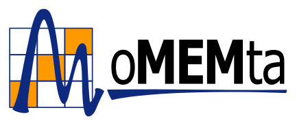

# The MoMEMta project

**MoMEMta** is a C++ software package to compute Matrix Element weights. Designed in a modular way, it covers the needs of experimental analysis workflows at the LHC. MoMEMta provides working examples for some common final states ($\text{t}\bar{\text{t}}$, WW, …). If you are an expert user, be prepared to feel the freedom of configuring your MEM computation at all levels!

If you're using MoMEMta for your research, please make sure you're citing our [reference paper](https://inspirehep.net/record/1674319)!

MoMEMta is based on:

 - C++, [ROOT](https://root.cern.ch/), [Lua](http://www.lua.org/) scripting language
 - [Cuba](http://www.feynarts.de/cuba/) (Monte-Carlo integration library)
 - External PDFs ([LHAPDF](http://lhapdf.hepforge.org/) by default)
 - External Matrix Elements (currently provided by our MadGraph C++ [exporter plugin](https://github.com/MoMEMta/MoMEMta-MaGMEE))

You will probably want to start with our [getting started guide](getting-started.md), or check out our set of [working examples](https://github.com/MoMEMta/Tutorials).

## Our team

 - Sébastien Brochet
 - Brieuc François
 - Alessia Saggio
 - Miguel Vidal
 - Sébastien Wertz

Special thanks to Matthias Komm who designed our logo!

## Acknowledgements

This work would not have been possible without the help of the MadWeight team and funding of:

    
    
    
    
    

MoMEMta is part of a project that has received funding from the European Horizon 2020 research and innovation programme under grant agreement N°675440.
